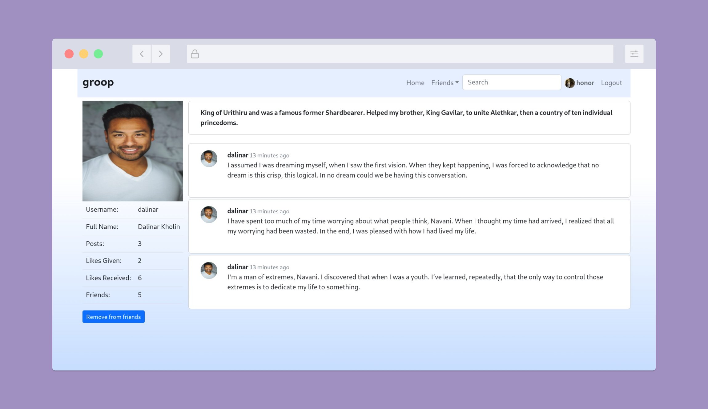

# Groop

A social platform website made with Django.

## Features

- User Authentication
- Post Wall
- Profile
- Settings
- Friends
    - Friend Request

## Prerequisites

- Python v3.9+
- Django v4.1+

## Getting Started

- Start groop

```console
docker compose up
```

**then go to http://localhost:8000**

## Screenshots

<p float="left">



</p>


